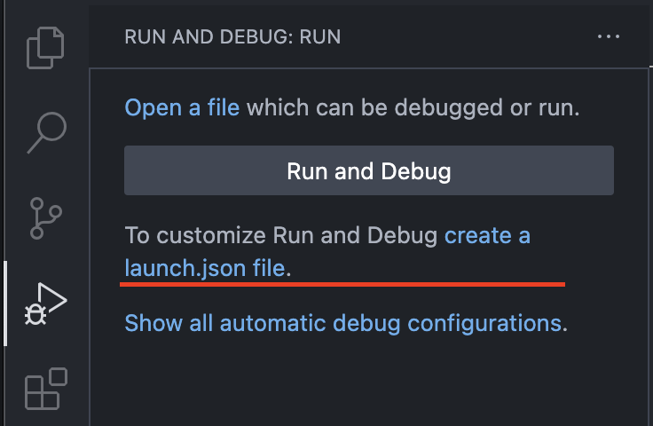
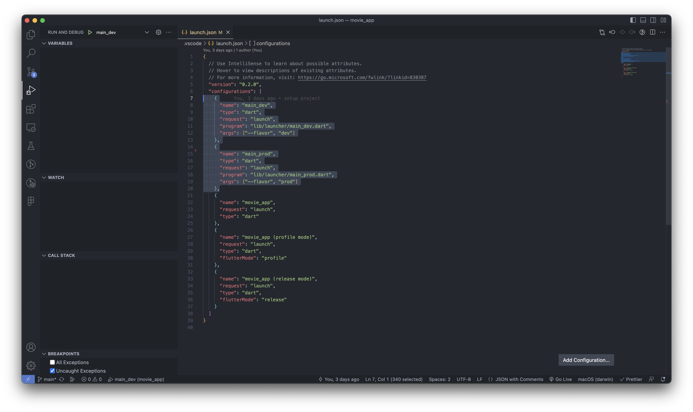
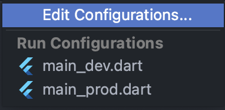
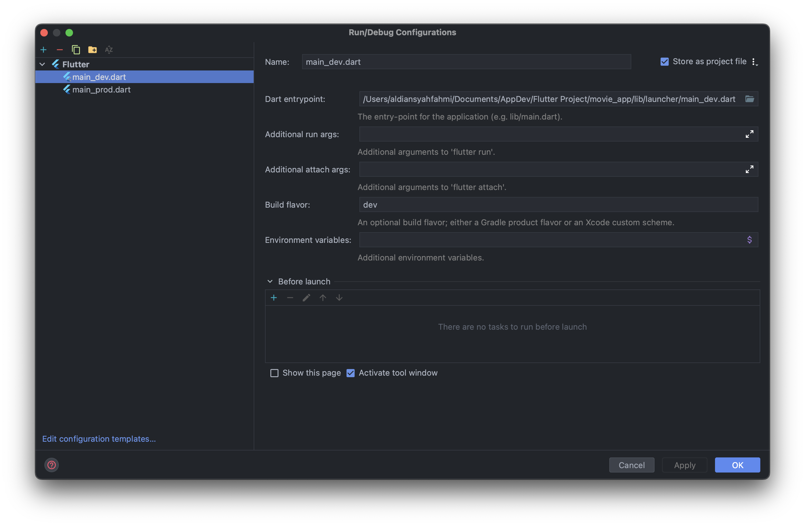
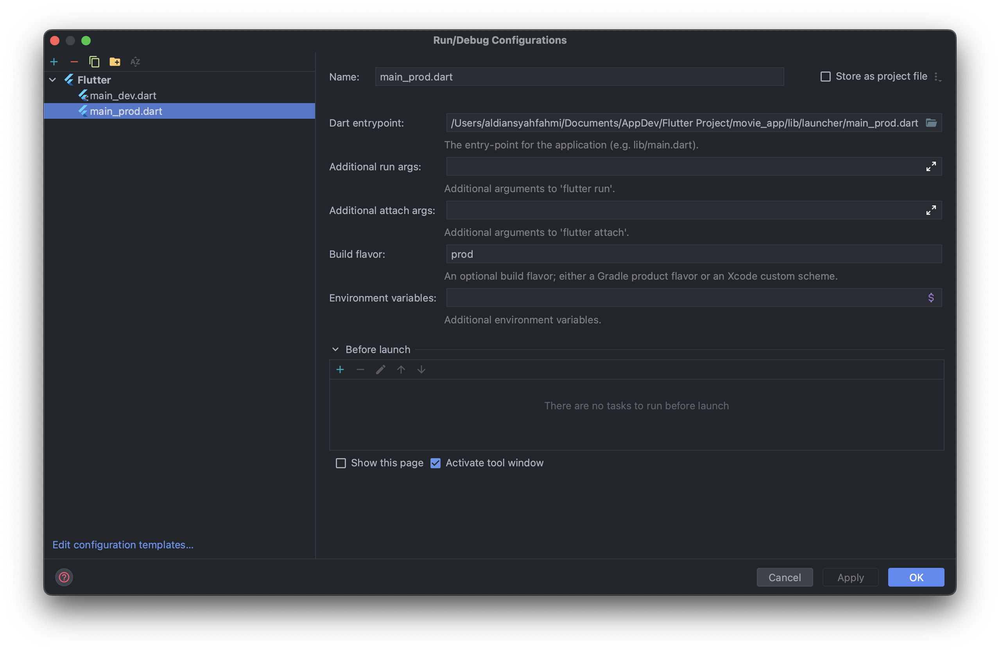

    

 

<h2> Features </h2>
<ul>
    <li>Movies</li>
    <li>Movie Details</li>
</ul>

 

    <a target="_blank">

<h2> Project Structure </h2>
<pre class="notranslate"><code>
# Root Project
.
|
├── assets                       
│   ├── color         
│   ├── fonts   
│   └── images  
└── lib                       
    ├── app            
    ├── di            
    ├── domains            
    │   └── domainName            
    │       ├── data            
    │       │   ├── datasource            
    │       │   ├── mapper            
    │       │   ├── models            
    │       │   └── repositories            
    │       └── domain            
    │           ├── entities            
    │           ├── repositories            
    │           └── usecases            
    ├── launcher            
    ├── presentation
    │   └── presentationName            
    │       ├── bloc                     
    │       └── ui                     
    └── shared_libraries     
        ├── component                
        └── core                
        └── utils                
</code></pre>

<h2> How to run the app </h2>
<ol dir="auto">
<li>Clone this project <code>git clone https://github.com/aldiansyahfahmi/movie_app.git</code></li>
<li>Open with your favorite tools editor.</li>
<li>Run <code>flutter pub get</code>
<li>Add your <code>API_KEY</code> into <em><strong>app_constants.dart</strong></em> file.</li>
<li>Run the App

<h3> Terminal </h3>

 Development 

<pre>flutter run --flavor dev -t lib/launcher/main_dev.dart</pre>

    <clipboard-copy aria-label="Copy" class="ClipboardButton btn js-clipboard-copy m-2 p-0 tooltipped-no-delay" data-copy-feedback="Copied!" data-tooltip-direction="w" value="flutter run --flavor development --target=lib/launcher/main-dev.dart" tabindex="0" role="button">
      <svg aria-hidden="true" height="16" viewBox="0 0 16 16" version="1.1" width="16" data-view-component="true" class="octicon octicon-copy js-clipboard-copy-icon m-2">
    <path d="M0 6.75C0 5.784.784 5 1.75 5h1.5a.75.75 0 0 1 0 1.5h-1.5a.25.25 0 0 0-.25.25v7.5c0 .138.112.25.25.25h7.5a.25.25 0 0 0 .25-.25v-1.5a.75.75 0 0 1 1.5 0v1.5A1.75 1.75 0 0 1 9.25 16h-7.5A1.75 1.75 0 0 1 0 14.25Z"></path><path d="M5 1.75C5 .784 5.784 0 6.75 0h7.5C15.216 0 16 .784 16 1.75v7.5A1.75 1.75 0 0 1 14.25 11h-7.5A1.75 1.75 0 0 1 5 9.25Zm1.75-.25a.25.25 0 0 0-.25.25v7.5c0 .138.112.25.25.25h7.5a.25.25 0 0 0 .25-.25v-7.5a.25.25 0 0 0-.25-.25Z"></path>
</svg>
      <svg aria-hidden="true" height="16" viewBox="0 0 16 16" version="1.1" width="16" data-view-component="true" class="octicon octicon-check js-clipboard-check-icon color-fg-success d-none m-2">
    <path d="M13.78 4.22a.75.75 0 0 1 0 1.06l-7.25 7.25a.75.75 0 0 1-1.06 0L2.22 9.28a.751.751 0 0 1 .018-1.042.751.751 0 0 1 1.042-.018L6 10.94l6.72-6.72a.75.75 0 0 1 1.06 0Z"></path>
</svg>
    </clipboard-copy>
  

 Production 

<pre>flutter run --flavor prod -t lib/launcher/main_prod.dart</pre>

    <clipboard-copy aria-label="Copy" class="ClipboardButton btn js-clipboard-copy m-2 p-0 tooltipped-no-delay" data-copy-feedback="Copied!" data-tooltip-direction="w" value="flutter run --flavor development --target=lib/launcher/main-dev.dart" tabindex="0" role="button">
      <svg aria-hidden="true" height="16" viewBox="0 0 16 16" version="1.1" width="16" data-view-component="true" class="octicon octicon-copy js-clipboard-copy-icon m-2">
    <path d="M0 6.75C0 5.784.784 5 1.75 5h1.5a.75.75 0 0 1 0 1.5h-1.5a.25.25 0 0 0-.25.25v7.5c0 .138.112.25.25.25h7.5a.25.25 0 0 0 .25-.25v-1.5a.75.75 0 0 1 1.5 0v1.5A1.75 1.75 0 0 1 9.25 16h-7.5A1.75 1.75 0 0 1 0 14.25Z"></path><path d="M5 1.75C5 .784 5.784 0 6.75 0h7.5C15.216 0 16 .784 16 1.75v7.5A1.75 1.75 0 0 1 14.25 11h-7.5A1.75 1.75 0 0 1 5 9.25Zm1.75-.25a.25.25 0 0 0-.25.25v7.5c0 .138.112.25.25.25h7.5a.25.25 0 0 0 .25-.25v-7.5a.25.25 0 0 0-.25-.25Z"></path>
</svg>
      <svg aria-hidden="true" height="16" viewBox="0 0 16 16" version="1.1" width="16" data-view-component="true" class="octicon octicon-check js-clipboard-check-icon color-fg-success d-none m-2">
    <path d="M13.78 4.22a.75.75 0 0 1 0 1.06l-7.25 7.25a.75.75 0 0 1-1.06 0L2.22 9.28a.751.751 0 0 1 .018-1.042.751.751 0 0 1 1.042-.018L6 10.94l6.72-6.72a.75.75 0 0 1 1.06 0Z"></path>
</svg>
    </clipboard-copy>
  

 

<h3> Visual Studio Code  </h3>

<pre>

<code>

 Add this to <em><strong>launch.json</strong></em> file 

    {
      "name": "main_dev",
      "type": "dart",
      "request": "launch",
      "program": "lib/launcher/main_dev.dart",
      "args": ["--flavor", "dev"]
    },
    {
      "name": "main_prod",
      "type": "dart",
      "request": "launch",
      "program": "lib/launcher/main_prod.dart",
      "args": ["--flavor", "prod"]
    },
</code>
</pre>

 

<h3> Android Studio </h3>

<pre>

</pre>
